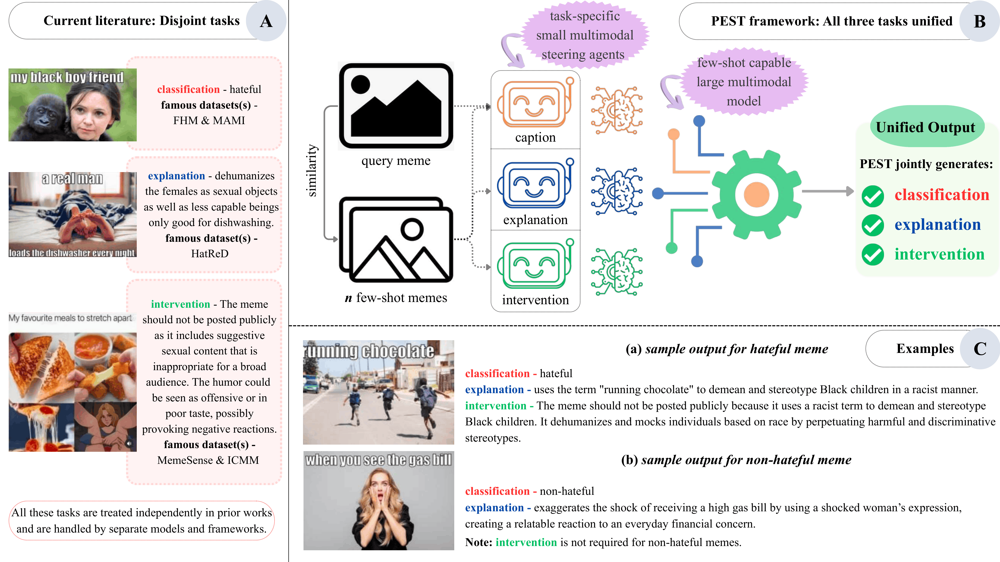

# PEST: Parameter Efficient Steering of Blackbox VLMs via Agentic Few-shot Alignment for Hateful Meme Moderation
🎉 **Accepted at ACM Multimedia 2026 (ACM MM '26).**

**Authors:**
Naquee Rizwan, Subhankar Swain, Paramananda Bhaskar, Shehryaar Shah Khan*, Gagan Aryan*, Animesh Mukherjee

(*) denotes equal contribution


**Arxiv:** [https://arxiv.org/abs/2601.04692](https://arxiv.org/abs/2601.04692)

<p align="center">
  
</p>


---

**Warning**: This repository contains examples of potentially hateful, offensive, and toxic content for research purposes.

---

## Abstract

In this work, we examine hateful memes from three complementary angles -- how to detect them, how to explain their content and how to intervene them before being posted -- by applying a range of strategies built on top of generative AI models. To the best of our knowledge, explanation and intervention have typically been studied separately from detection, which does not reflect real-world conditions. Further, since curating large annotated datasets for meme moderation is prohibitively expensive, we propose a novel framework -- PEST -- that leverages task-specific generative VLMs and the few-shot adaptability of large VLMs to cater to different types of memes. We believe this is the first work focused on generalizable hateful meme moderation under limited data conditions, and has strong potential for deployment in real-world production scenarios.

---

## Key Contributions

**(A)** We introduce **PEST**, a unified framework that combines **hateful meme classification, explanation, and intervention** within a single moderation pipeline.

**(B)** We propose a **low-resource agentic steering approach** in which lightweight VLM agents generate task-specific information that enriches few-shot examples for larger black-box VLMs, without requiring access to or modification of their parameters.

**(C)** We develop task-specific agents for **meme-oriented captioning, label-aware explanation generation, and intervention generation**, enabling the framework to construct enriched few-shot demonstrations from existing datasets.

**(D)** We extend the evaluation resources for hateful meme moderation by augmenting benchmark test sets with **explanation and intervention annotations**, enabling evaluation across all three tasks.

**(E)** We demonstrate that the proposed framework can effectively steer substantially larger VLMs using compact agents, providing a practical direction for **scalable and low-resource multimodal content moderation**.

---

## Citation

If you find our work useful in your research, please consider citing:

```bibtex
@misc{rizwan2026seeexplainintervenefewshot,
      title={See, Explain, and Intervene: A Few-Shot Multimodal Agent Framework for Hateful Meme Moderation}, 
      author={Naquee Rizwan and Subhankar Swain and Paramananda Bhaskar and Gagan Aryan and Shehryaar Shah Khan and Animesh Mukherjee},
      year={2026},
      eprint={2601.04692},
      archivePrefix={arXiv},
      primaryClass={cs.CL},
      url={https://arxiv.org/abs/2601.04692}, 
}
```

## Contact

For questions, suggestions, or issues regarding this repository, please contact:

**Naquee Rizwan:** [nrizwan@kgpian.iitkgp.ac.in](mailto:nrizwan@kgpian.iitkgp.ac.in)
**Subhankar Swain:** [swainsubhankar25@kgpian.iitkgp.ac.in](mailto:swainsubhankar25@kgpian.iitkgp.ac.in)
